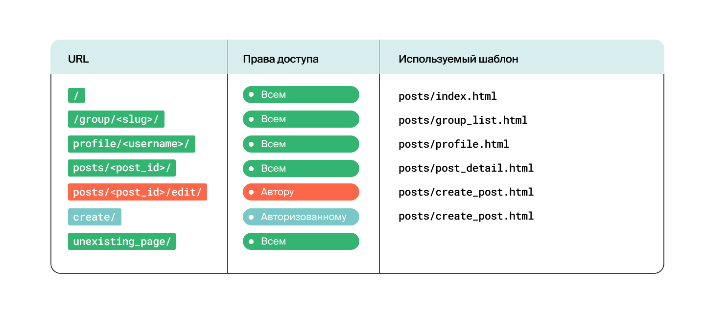
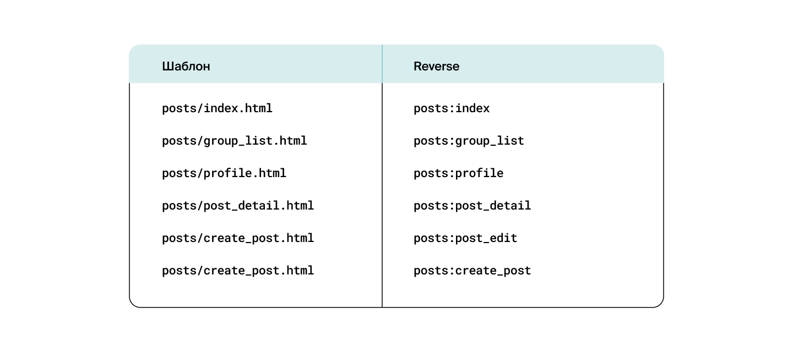
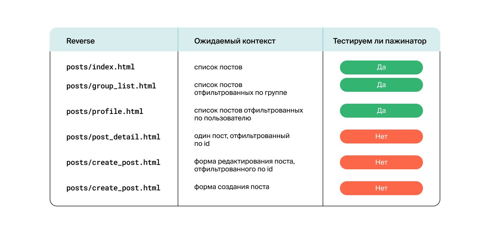

# Проект Yatube v3

[](https://www.python.org/)
[](https://www.djangoproject.com/)
[](https://docs.python.org/3/library/unittest.html)

Яндекс Практикум.  Покрытие тестами проекта Yatube v2 

## Описание

Yatube - это социальная сеть с авторизацией, персональными лентами, комментариями и подписками на авторов статей.

## Функционал

1. Написаны тесты для моделей приложения `Django`:

   - протестированы модели приложения `posts` в `Yatube`;
   - добавлен метод `str` в классы `Post` и `Group`;
   - протестировано отображения значения поля `str` в объектах моделей.

2. Написаны тесты для URLs приложения `Django`:

   - проверена доступность страниц и правильность названия шаблонов приложения `Posts` проекта `Yatube` согласно авторизации;
   - проверен запрос к несуществующей странице, вадающий ошибку `404`.
  
     

3. Написаны тесты для `views`: `namespase:name` и шаблонов приложения `Django`:

   - написаны тесты, проверяющие соответствие html-шаблонов во view - функциях.
       

4. Написаны тесты для `views` контекста приложения `Django`:

   - проверена корректность словаря `context`, передаваемого в шаблон при вызове.
         

5. Написаны тесты для `views` проверки создания поста приложения `Django`:

   - проверно, что если при создании поста и указания группы, пост появляется:
     - на главной странице сайта;
     - на странице выбранной группы;
     - в профайле пользователя.
   - проверено, что пост не попадает в группу, для которой не был предназначен.

6. Написаны тесты для проверки `Forms` приложения `Django`:

   - написаны тесты проверки создания новой записи в БД, при отправке валидной формы со страницы создания поста `reverse('posts:create_post')`;
   - написаны тесты проверки изменения поста с `post_id` в БД, при отправке валидной формы со страницы редактирования поста `reverse('posts:post_edit', args=('post_id',))`.

## Установка

1. Клонировать репозиторий:

   ```python
   git clone https://github.com/egorcoders/hw04_tests.git
   ```

2. Перейти в папку с проектом:

   ```python
   cd hw04_tests/
   ```

3. Установить виртуальное окружение для проекта:

   ```python
   python -m venv venv
   ```

4. Активировать виртуальное окружение для проекта:

   ```python
   # для OS Lunix и MacOS
   source venv/bin/activate

   # для OS Windows
   source venv/Scripts/activate
   ```

5. Установить зависимости:

   ```python
   python3 -m pip install --upgrade pip
   pip install -r requirements.txt
   ```

6. Выполнить миграции на уровне проекта:

   ```python
   cd yatube
   python3 manage.py makemigrations
   python3 manage.py migrate
   ```

7. Запустить проект локально:

   ```python
   python3 manage.py runserver

   # адрес запущенного проекта
   http://127.0.0.1:8000
   ```

8. Зарегистирировать суперпользователя Django:

   ```python
   python3 manage.py createsuperuser

   # адрес панели администратора
   http://127.0.0.1:8000/admin
   ```
